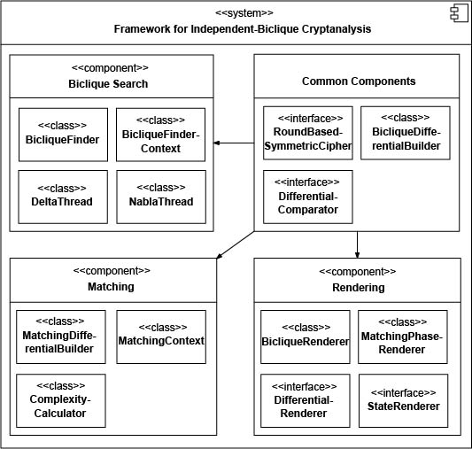

<h2>General information</h2>
<h3>What is Janus?</h3>

Janus is a small framework which is built in Java to provide assistance in finding <i>independent-biclique attacks</i>. Given a certain cipher, Janus not only finds an optimal bipartite graph (biclique), but also an optimal matching-with-precomputation step, rendering the found biclique, and determining the computational complexity of the attack.

<h3>What are independent-bicliques attacks?</h3>

Biclique cryptanalysis was first introduced by Khovratovich et al. in 2011 and presented at the FSE 2012. Bicliques represent an improvement of the splice-and-cut approach which is on the other hand based on common meet-in-the-middle techniques. More detailed, biclique cryptanalysis uses a complete bipartite graph (biclique) which can be constructed over a part of a primitive to extend an existing meet-in-the-middle or similar attack. While the biclique-based splice-and-cut approach was intentionally concepted to target hash functions, it has become a well-known technique to attack block ciphers today. 

A biclique is a complete bipartite graph which covers some steps of a
cipher. It connects every element in a set of starting states <i>S_j</i> with every element
in a set of ending states <i>C_i</i>, where a path from <i>S_{j}</i> to <i>C_{i}</i> represents
the encryption under a key <i>K[i,j]</i>. More formally, the 3-tuple of sets <i>[\{S_j\}, \{C_i\},
\{K[i,j]\}]</i> is called a <i>d-dimensional biclique</i>, if

<i>
\forall i,j \in \{0, \ldots, 2^d - 1 \}: \quad S_j \xrightarrow[B]{K[i,j]} C_i.
</i>

The basic idea is to divide the key space into <i>2^{k-2d}</i> groups of <i>2^{2d}</i> keys, where <i>k</i>
denotes the length of the secret key and <i>d</i> is the dimension of the biclique.
A biclique can then be defined for one such group of keys <i>K[i,j]</i>, where the individual keys
are represented relative to a so-called \textit{base key} of the group, <i>K[0,0]</i>, and two
differences <i>\Delta^K_{i}</i> and <i>\nabla^K_{j}</i>:

<i> K[i,j] = K[0,0] \oplus \Delta_{i} \oplus \nabla_{j}. </i>

For every biclique, the adversary tests <i>2^{2d}</i> keys with <i>2 \cdot 2^d</i> computations.
Therefore, it needs to construct <i>2^{k - 2d}</i> bicliques to cover the full key space.
For the time complexity, Bogdanov et al. proposed the equation:

<i>
C_{full} = 2^{k - 2d} \left(C_{biclique} + C_{decrypt} + C_{precompute} + C_{recompute} +
C_{falsepos}\right),
</i>

where
<ul>
	<li> <i>C_{biclique}</i> denotes the costs for constructing a biclique, 
    <li> <i>C_{decrypt}</i> is the complexity of the oracle to decrypt <i>2^d</i> ciphertexts, 
	<li> <i>C_{precompute}</i> represents the effort for the computation of <i>v</i> for
	<i>2^d</i> computations of <i>E_2 \circ E_1</i>, 
	<li> <i>C_{recompute}</i> describes the costs of recomputing <i>2^{2d}</i> values <i>v_{i,j}</i> in both
	directions, and
	<li> <i>C_{falsepos}</i> is the complexity to eliminate false positives.  
</ul>
The full computational effort of the attack is dominated by the recomputations costs. The
memory requirements are upper bounded by storing <i>2^d</i> intermediate states <i>v_{i,j}</i>.

Moreover, in the case when a constructed biclique is quite short and the matching part needs to cover too many rounds, then a meet-in-the-middle attack may no longer be applicable. In such cases, Bogdanov et al. proposed an alternative procedure called <i>matching with precomputations</i>. This approach is practically an optimized exhaustive search. Thus, it can be applied to any primitive and any given number of rounds. The important point is to identify a matching which has a lowest possible effort. 

<h3>Why use an automated approach?</h3>

Finding good (independent) bicliques over a given number of rounds is a time-consuming task which requires in-depth knowledge of the investigated cipher to find well-suited differentials. Thus, it is adequate to think about using a computer to find such bicliques. Usually, implementations of common block cipher APIs are not designed to provide a suffciently fine granularity, e.g., access to single steps and the basic operations of the cipher is not supported, but required
to find good bicliques.

A unified API is needed to reduce the effort of modifying a block cipher implementation for the biclique search. In addition, such an API would allow to apply one single biclique-searching framework that fits all. Janus is open source and free to use. It provides a highly modular and flexible API, i.e., it allows the user to determine parameters
like the used cryptographic primitive, the starting/ending round, the dimension of the biclique, the starting difference, etc.

<h2>Concepts of Janus</h2>

Our current implementation consists of four subsystems, as shown in the figure below.
<ol>
	<li>The <b>biclique search</b> subsystem is responsible for searching
	for independent differential trails over some rounds of a given primitive.</li>
	<li>Given a found biclique, the <b>matching</b> subsystem analyzes the remaining parts 	of the cipher to find a matching which leads to an attack with a minimal computational effort.</li>
	<li>The <b>rendering</b> subsystem can visualize bicliques as well as matching phase differentials in PDF format, using the community version 5.3.0 of the open-source library <a href="http://www.itextpdf.com/"alt="Link to iText" title="iText">iText</a>.</li>
	<li>Moreover, the framework contains a number of common components, such as cipher
	implementations, serialization and utility classes, as well as cipher-dependent helper classes which generate and compare differentials.</li>
</ol>
</img>

<h3>Biclique search</h3>

The task of finding independent bicliques can be transformed into the task of finding pairs of independent differentials <i>(\Delta, \nabla)</i>. In advance, the user needs to specify:
<ul>
	<li>a target cipher <i>E</i>,</li>
	<li>a round range <i>[r,s]</i> which define a subcipher <i>B</i> in <i>E</i>,</li>
	<li>the dimension of bicliques <i>d</i>,</li>
	<li>a strategy to test the independency of differentials,</li>
	<li>and a strategy to define and generate round key differences.</li>
</ul>
Assume that <i>B</i> covers the rounds <i>[r, s], 1 \leq r \leq s \leq N_r</i> of a
given cipher <i>E</i>, where <i>N_r</i> is the total number of rounds in <i>E</i>.
We denote by <i>N_r^{B} = s - r + 1</i> the number of rounds covered by <i>B</i>, and

<ul>
  	<li> by <i>T_i</i> the state after Round <i>i</i>,</li>
  	<li> by <i>U_i</i> the intermediate state after all non-linear operations in Round <i>i</i>, </li>
  	<li> and by <i>K_i</i> the round key which is used in Round <i>i</i>.</li>
</ul>
We further call the state of the cipher's key register which contains the key for Round <i>r</i>, as
the starting key, and the state which contains the key for Round <i>s</i> the ending key.

First, we fix <i>K[0,0]</i> and <i>S_0</i> to all zeroes and derive <i>C_0</i>. This base computation is
computed only once for a given cipher and round interval. We create a trail <i>\Delta^f</i>
which will contain all state values <i>T_i</i>, all intermediate state values <i>U_i</i>, as well all
round keys <i>K_i</i> which are used in <i>B</i>. At the beginning, we initialize them with
all-zero values.
Then, we choose a starting key difference <i>\Delta^{K^f}</i> with respect to <i>K[0,0]</i> with <i>d</i> bits
set. In the following, we iterate over all <i>2^d</i> possible values for the <i>d</i> set bits in
<i>\Delta^{K^f}</i>, and compute <i>2^{d} - 1</i> differential trails

<i> 
S_0 \xrightarrow[B]{K[0,0] \oplus \Delta^{K^f}_i} C^f_i, \quad 
\forall\ i \in \{1, \ldots, 2^d - 1\}.
</i>

We derive the bit-wise XOR between the corresponding states, intermediate states and round
keys of the trail <i>\Delta^f</i> and the base computation:

<i> 
\Delta^f_i = \left(S_0 \xrightarrow[B]{K[0,0]} C_0 \right) \oplus
	\left(S_0 \xrightarrow[B]{K[0,0] \oplus \Delta^{K^f}_i} C^f_i \right). 
</i>

Bits which are active in any of the <i>2^{d - 1}</i> differential trails <i>\Delta^f_i</i> should remain
active in the differential <i>\Delta^f</i>. Thus, the <i>\Delta^f_i</i>-trails are accumulated to
<i>\Delta^f</i> by applying the logical OR pair-wise to all corresponding state and round key
differences of all differentials <i>\Delta^f_i</i>:

<i>
\Delta^f \gets \bigvee\limits_{i = 1}^{2^d - 1} \Delta^f_i.
</i>

The procedure is then repeated for in total <i>N_d</i> unique starting key differences
<i>\Delta^{K^f}</i>, <i>\forall f \in \{1, \ldots, N^d - 1\}</i>. All <i>N_d</i> accumulated forward trails
<i>\Delta^f</i> are stored in a list, before the <i>N_d</i> backward trails <i>\nabla^b</i> are computed
with a similar procedure.

We need to check for every pair of differentials <i>(\Delta^f, \nabla^b)</i>, if there are any
corresponding intermediate states or round keys, which share parts that are active in
non-linear operations. If not, the pair yields an independent biclique. Since any identified
biclique can be used to mount an attack, we provide an option for the early abort as soon as
the first pair has been found.  The time complexity of the biclique search process is given by

<i> C_{time} = C_{forward} + C_{backward} + C_{testing}, </i>

where
<ul>
  	<li><i>C_{forward}</i> is given by constructing <i>2^{N_d} \Delta</i>-differentials,</li>
  	<li><i>C_{backward}</i> by constructing <i>2^{N_d} \nabla</i>-differentials,</li>
  	<li>and <i>C_{testing}</i> by comparing <i>2^{2N_d}</i> pairs of differentials <i>(\Delta, \nabla)</i>.</li>
</ul>
The complexity is dominated by the effort for testing <i>2^{2N_d}</i> pairs of differentials. 
We store the states and round keys of <i>2^{N_d}</i> forward differentials, where
every differential holds <i>N_r^{B} + 1</i> (from <i>r - 1</i> to <i>s</i>) state differences,
<i>N_r^{B}</i> (from <i>r</i> to <i>s</i>) intermediate state differences, and a cipher-dependent
number of <i>N_k</i> round key differences (since their can be pre- or post-whitening keys). Hence,
we need to store

<i> C_{memory} = 2^{N_d} \cdot (2 N_r^{B} + 1) \cdot n + N_k \cdot k </i>

bits, where <i>n</i> and <i>k</i> denote state and key size, respectively. If the available memory is not
sufficient to store all forward differentials, the biclique search can be performed in multiple
iterations, where in each iteration, a different fraction of the differentials is stored and
tested.

In our framework the class <tt>BicliqueFinder</tt> (finder, hereafter) is responsible for starting and
coordinating the biclique search. Prior, the client passes the required parameters -- the round
range <i>[r, s]</i>, the target cipher, the dimension <i>d</i>, etc. -- encapsulated in an instance of
type <tt>BicliqueFinderContext</tt>. To speed up the search, the finder then simply delegates the computation
and testing of differentials to parallel-working instances of two internal classes <tt>DeltaThread</tt>
and <tt>NablaThread</tt>, which compute all forward differentials first, and backward differentials
second.

Since ciphers contain non-linear operations at different steps in its round function, the
finder needs a cipher-dependent strategy to test the independency of differential pairs.
Therefore, our framework contains an interface <tt>DifferentialComparator</tt> and a package with helper classes, e.g, 
<tt>AESHelper</tt> or <tt>ARIAHelper</tt> that implement it and solve this task for a
particular primitive. The correct helper class that shall be used in an attack can be set as
a parameter by the client.

<h3>Differences</h3>
We have to clarify the strategy to generate key differences, i.e., locating the <i>d</i>
active bits. The number of the differentials to test, <i>N_d</i>, depends on the dimension of the
biclique and the key length. Assume, we are given a cipher with a key length <i>k</i> and a chosen
dimension <i>d</i>. Then, we could potentially test <i>N_{d} = \binom{k}{d}</i> differentials, which
becomes inpracticable fast for <i>k \geq 64</i>. Though, this effort can be reduced significantly
for byte-wise- or nibble-wise operating ciphers. Here, we consider three different strategies
to generate key differences.

<ol>
<li> Firstly, we can set only a minimum of <i>d</i> active bits in the key difference. Then,
considering our example with byte-wise operating primitives, there are only <i>
\frac{k}{\lceil d/8\rceil}</i> bytes which can be active in the round key at the first or last
round of the biclique.
As a consequence, for byte-wise and nibble-wise operating primitives, the testing effort
reduces to

<i> 
N_{d} = \tbinom{k / 8}{\lceil d / 8\rceil} 
\quad \text{and} \quad
N_{d} = \tbinom{k / 4}{\lceil d / 4\rceil} 
</i>
 
differentials, respectively. For bit-wise operating primitives, one can limit the number of
differentials to a user-definable number of unique random start key differences.
</li>
<li> As a second approach, one can use the same active bits multiple times in the start key
difference. At the first sight, these will produce additional active bytes in the state after a
key injection, making it harder for the differential to be independent in a pair. At second
sight, the further active bytes may cancel out byte differences in the key schedule and/or the
round transformation of AES-like ciphers, as we can learn from the attack on SQUARE by Mala. 
Though, this strategy increases the number of tested keys to <i>N_d = 2^{k/8}</i> for
byte-wise and <i>N_d = 2^{k/4}</i> for nibble-wise primitives, respectively.
</li>
<li> Alternatively, one can employ custom rules to generate round-key differences. In their
attack on AES-192, Bogdanov \etAl employed the inverse result of a \termname{MixColumns}
operation as a part of the round key difference. In their attack on ARIA-256,
Chen and Xue used a dedicated difference where the first half of the 256-bit key canceled the
difference injected by the left half. One can learn from those examples that cipher-specific
key differences can result in longer bicliques for AES-like ciphers. Since the testing of all
custom differences in the key space is infeasible, the task of choosing "good" key
differentials can be left open to the user.
</li>
</ol>

<h3>Matching</h3>
A matching-with-precomputations step is supposed to be applied to the subciphers -- in our case <i>E_2 \circ E_1</i> -- not covered by a given biclique. Hence, this step is located after a biclique search. Our framework investigates two aspects to identify a well-suited matching: first, it tests all possible rounds which can be used to locate <i>V</i>:

<i> P \xrightarrow[E_1]{} V \xleftarrow[E_2^{-1}]{} S, </i>

and second, it tests all possible nibbles or bytes in <i>V</i> which can be used for a partial matching. For every round <i>i</i> that can be used to locate <i>V</i>, we perform four steps:

<ol>
<li> First, we compute differentials from the start and the end of the matching part to the middle:

<i>
P \xrightarrow[E_1]{K[0,0] \oplus \nabla^K_j} v_i \oplus \nabla v_i,
\qquad \text{and} \qquad
v_i \oplus \Delta v_i \xleftarrow[E_2^{-1}]{K[0,0] \oplus \Delta^K_i} S.
</i>

Note, that these differential trails result from injecting differences in the round keys.
</li>
<li> Then, we create a new difference <i>\delta v</i> in which the bits that are used for matching are set. Then, we compute the differentials from <i>v</i> to the start and to the end:

<i>
P \oplus \delta P \xleftarrow[E_1^{-1}]{K[0,0]} v_i \oplus \delta v_i
\qquad \text{and} \qquad
v_i \oplus \delta v_i \xrightarrow[E_2]{K[0,0]} S \oplus \delta S,
</i>

These trails reflect all bits in the state which are needed to compute the bits that are used for partial matching.
</li>
<li>We need to consider only those parts of the states and round keys in the differential trails that are active in both differential trails, <i>P \rightarrow \delta v</i> and $\delta P \leftarrow v</i>, for the recomputation. We denote by <i>\wedge</i> the logical bit-, nibble- or byte-wise AND (depending on the cipher) which we apply between all bits of the corresponding states and round keys to compute the accumulated differential

<i> \Delta^p_i = (P \rightarrow \delta v_i) \wedge (\delta P \leftarrow v_i). </i>

Similarly, we compute

<i> \nabla^s_i = (\delta v_i \rightarrow S) \wedge (v_i \leftarrow \delta S). </i>

</li>
<li>As the final step, we count the number of active bits/nibbles/bytes in non-linear operations are counted in both <i>\Delta^p_i</i> and <i>\nabla^s_i</i> to have a single number which refers best to the recomputational effort.
</li>
</ol>

The merging is illustrated schematically in the following figure. At the top, we investigate how the key differences affect the state from outside in. In the middle, we choose a part of the state which we use to match at the state <i>v</i>, and go from inside out, investigating which parts of the states are needed to reconstruct it. Since we need to consider only those parts of the states and round keys in the differential trails that are active in both differential trails, we merge them in the bottom illustration.

</img>

Considering our implementation, the class <tt>MatchingDifferentialBuilder</tt> is responsible to perform the steps above. Similar to the biclique search, the required parameters are bundled in a context class <tt>MatchingContext</tt>. As a parameter, the context expects the found biclique, the cipher and a cipher-specific helper class, which allows to determine the number of active bits, nibbles or bytes in non-linear operations. After the optimal matching has been found and returned by the <tt>MatchingDifferentialBuilder</tt>, the class <tt>ComplexityCalculator</tt> computes the total complexity of the attack.

<h3>Rendering</h3>

Our framework allows to render identified bicliques and matching phases in PDF format, using the community version 5.3.0 of the open-source library <a href="http://www.itextpdf.com/"alt="Link to iText" title="iText">iText</a> which is licensed under the AGPL. The classes <tt>BicliqueRenderer</tt> and <tt>MatchingRenderer</tt> are responsible to carry out the rendering process. In the following, we provide the interfaces <tt>DifferentialRenderer</tt> and <tt>StateRenderer</tt> so that the rendering classes can be simply exchanged by the client according to the type of differential and the cipher.

<h2>Quickstart User Guide</h2>
<h3>Applications</h3>

The source code is given in the src folder. Additionally, two runnable java archives <tt>bicliquesearch.jar</tt>, and
<tt>matcher.jar</tt> have been exported. The classes <tt>BicliqueFinderApplication</tt> and
<tt>MatchingApplication</tt> are used as entry points for the JAR files.

The class <tt>BicliqueFinderApplication</tt> represents the application for the biclique search.
Its method <tt>setUp()</tt> creates instances of the classes <tt>BicliqueFinder</tt> and
<tt>BicliqueFinderContext</tt>, and instantiates the required
parameters for the biclique search from the command line arguments. The arguments should include
the target <tt>cipher</tt>, a <tt>differenceBuilder</tt>,
a <tt>differentialComparator</tt>, the <tt>dimension</tt> of bicliques, and a value
<tt>maxNumBicliquesRounds</tt> for the maximal number of rounds of the ciphers, where bicliques
are searched in. 

The cipher is instantiated using a class <tt>CipherFactory</tt> and its static method
<tt>createCipher(CipherName cipher)</tt>, which accepts a user-provided string for the cipher
name. Valid names are defined in an <tt>enum CipherName</tt> in the <tt>CipherFactory</tt> class. 
Depending on the type of the cipher, the differenceBuilder is initialized with
an instance of type <tt>BytewiseDifferenceBuilder</tt>, <tt>BitwiseDifferenceBuilder</tt>, or
<tt>NibblewiseDifferenceBuilder</tt>.

Since the non-linear operations can be positioned at different steps in the round
function of different ciphers, we needed a cipher-dependent helper class, which tests, if two
differentials share active components steps. Therefore, we created an interface <tt>DifferentialComparator</tt>,
and a package with helper classes (for instance, <tt>AESHelper</tt>, <tt>ThreeFishHelper</tt>),
that implement this interface for each cipher. They <tt>CipherHelper</tt> interface extends the
<tt>DifferentialComparator</tt> interface. A <tt>CipherHelperFactory</tt> and its static method
<tt>createCipherHelper</tt> are used to instantiate the correct helper class for the user-provided
cipher.

After the context parameters are created, the <tt>BicliqueFinderApplication</tt> calls the methods
<tt>testFindBicliquesAtEnd()</tt>, and <tt>testFindBicliquesAtStart()</tt>. Both methods
contain a loop, which iterates over the number of tested rounds for the created biclique. Found
bicliques are printed in the console output and are stored in a file. Finally, the method
<tt>tearDown()</tt> of the application calls <tt>tearDown()</tt> of the <tt>BicliqueFinder</tt> to
clear the lists of stored differentials and bicliques.

The class <tt>MatchingApplication</tt> is structured similarly to the <tt>BicliqueFinderApplication</tt> class. Its method <tt>setUp()</tt> instantiates a <tt>MatchingDifferentialBuilder</tt> and a <tt>ComplexityCalculator</tt>. The user provides a path to an XML file of a serialized biclique. The biclique is created by an instance of the class <tt>BicliqueXMLParser</tt>. Moreover, the user provides a cipher name as argument, from which the corresponding cipher and a <tt>cipherHelper</tt> are constructed by the factories, like in the <tt>BicliqueFinderApplication</tt>.

The <tt>CipherHelper</tt> interface also extends the <tt>DifferentialActiveComponentsCounter</tt>, which is used to determine the number of active components in non-linear operations in the matching rounds. The found matching phase is given as the input for a <tt>ComplexityCalculator</tt>, and the individual summands of the attack complexity are printed on the console. At the end, the matching phase is rendered and saved in PDF format.

For every cipher and cipher version, there exists a JUnit test case <tt>&lt;cipher+version&gt;BicliqueTest</tt> for the biclique search, and a <tt>&lt;cipher+version&gt;MatchingTest</tt> for the creation of the matching phase, respectively, for instance, <tt>AES128BicliqueTest</tt> and <tt>AES128MatchingTest</tt>. To avoid code repetition, the tests inherit from the abstract classes <tt>AbstractBicliqueFinderTest</tt> and <tt>AbstractMatchingTest</tt>.

Both applications employ the <a href="http://commons.apache.org/cli/" title="Apache Commons CLI library" alt="Apache Commons CLI library">Apache Commons CLI library</a> in version 1.2 to process command line options. As required parameters, the exported <tt>bicliquesearch.jar</tt> runnable expects a cipher, the dimension, and the maximal number of rounds. A valid call would be, for instance,

<tt>java -jar bicliquesearch.jar -c aes128 -d 8 -r 4</tt>.

If a parameter is missing, the application displays a help view:

<tt>
Missing required options: c, d, r 
usage: bicliquesearch 
 -c &lt;arg&gt;   Name of the cipher to test. Allowed values for cipherName 
            include (any casing allowed): 
            AES128, AES192, AES256, ARIA128, ARIA192, 
            ARIA256, BKSQ96, BKSQ144, BKSQ192, KHAZAD, 
            LED64, LED128, PRESENT80, PRESENT128, SQUARE, 
            THREEFISH256, THREEFISH512, THREEFISH1024, WHIRLPOOLCIPHER 
 -d &lt;arg&gt;   Dimension of the biclique. Defaults to 8. 
 -debug     Log debugging information. Defaults to false. 
 -r &lt;arg&gt;   Maximum number of rounds for bicliques. 
 -stop      Stops the search on current rounds, if one biclique was found. 
            Defaults to true.
</tt>

The exported runnable <tt>matchingsearch.jar</tt> expects the name of a cipher, a path to a serialized
biclique file, and a output path, where a PDF will be created, which contains a visual
representation of the best found matching phase. A valid call would be, for instance,

<tt>java -jar matchingsearch.jar -c aes128 -i results/xml/aes128_8_10.xml -o results/matching/aes128_8_10.pdf</tt>.

<h3>Ciphers</h3>

We need cipher implementations, which support round-wise encryption and decryption, and which offer
access to internals such as round keys. Unfortunately, these requirements discard existing cipher
implementations. Instead, we needed custom implementations of the investigated ciphers, and
have proposed a given interface <tt>RoundBasedSymmetricCipher</tt>.
Our cipher implementations inherit from the abstract class
<tt>AbstractRoundBasedSymmetricCipher</tt>. For ciphers which provide several versions, like
the AES with the 128-bit, 192-bit, and 256-bit versions, there is one abstract base class
(e.g., <tt>AES</tt>), which contains the major parts of the cipher logic, and concrete child classes
(<tt>AES128</tt>, <tt>AES192</tt>, <tt>AES256</tt>), which initialize their parent class with
individual state and key sizes, and may contain individual key schedules. To ensure that all our
cipher implementations work correctly, there are JUnit test cases for all ciphers for both
encryption and decryption with the test vectors of their specifications.

To extend the length of bicliques, we need to start at round keys with a low difference, and derive
the secret keys from these. As a consequence, we need to invert the key schedule of the investigated
ciphers in order to generate the secret key out from a given round key. This is not possible with
all ciphers. Though, the ciphers we are interested in -- AES-like constructions, PRESENT, or
ThreeFish -- allow to reconstruct the secret key from a given state of the key-register at a certain round. The method
<tt>boolean canInvertKeySchedule()</tt> indicates, whether a primitive is able to invert the key
schedule. If this method returns <tt>true</tt>, the method <tt>ByteArray
computeExpandedKey(ByteArray keyPart, int round)</tt> is expected to compute the full expanded
key from a given part of the expanded key. The provided part is expected to represent the state of
the key register after the subkey for the given round was computed. The method <tt>ByteArray
computeExpandedKey(ByteArray keyPart, int round)</tt> is used in the classes
<tt>DifferentialBuilder</tt> and in the <tt>MatchingDifferentialBuilder</tt>.
